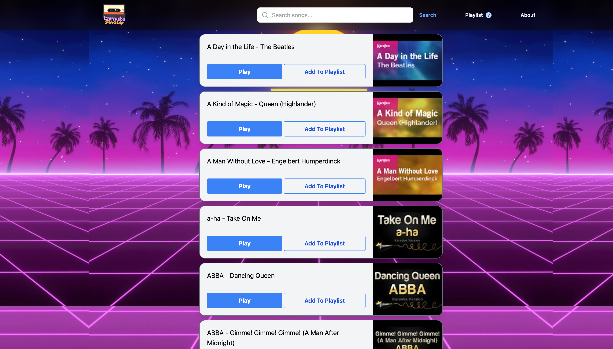
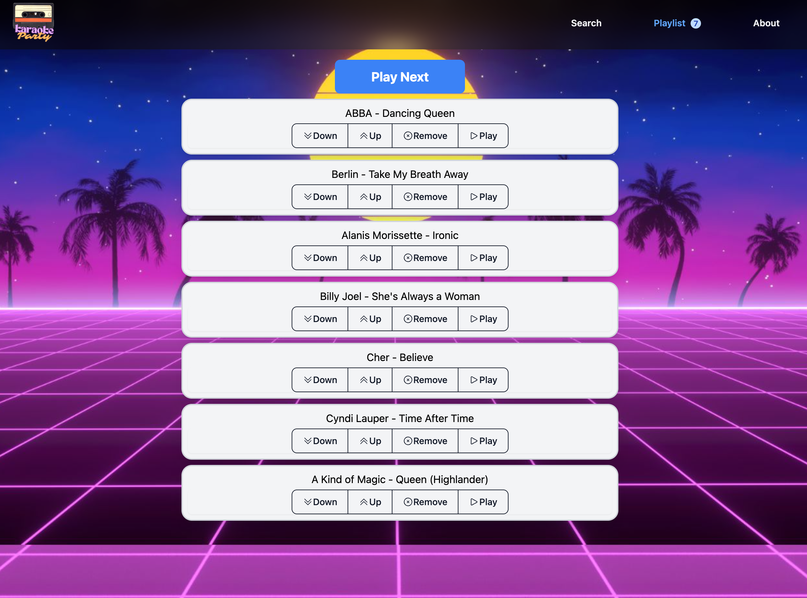

# Karaoke Party

A free karaoke party app. Search for a song, pick it from the list, and it opens the matching YouTube video so you can sing along. Build up a playlist for the whole party and step through it one song at a time.

Live at [karaoke.joyfulweb.net](https://karaoke.joyfulweb.net).





## How it works

The song catalog is a static list of YouTube videos (`frontend/data/data.json`) that ships with the app — there's no live backend for the site itself. Searching filters that list, and picking a song opens the video directly on YouTube.

## Project layout

- `frontend/` — the React + TypeScript + Vite app (search, playlist, playback). See `frontend/package.json` for scripts (`npm run dev`, `npm run build`, `npm run deploy`).
- `data/` — a Python command-line tool used to maintain the song catalog.

## Updating the song catalog

There are two ways to add or update songs:

1. **Manually** — edit `frontend/data/data.json` directly and add an entry with the video's `id`, `title`, `thumbnail`, `channelTitle`, and `publishTime`.
2. **Via the Python CLI** (`data/main.py`) — looks up a video by ID using the YouTube Data API and stores it in a Postgres database, which can then be exported back out to a `data.json` file. This requires:
   - A Google Cloud project with the YouTube Data API v3 enabled, and an API key for it
   - A Postgres database
   - A `data/.env` file with `GOOGLE_API_KEY` and `DB_URL` set

   ```bash
   cd data
   python -m venv .venv
   source .venv/bin/activate
   pip install -r requirements.txt
   python main.py
   ```

   Follow the prompts to enter a YouTube video ID, or enter `m` to export the current database contents to `data.json`.
